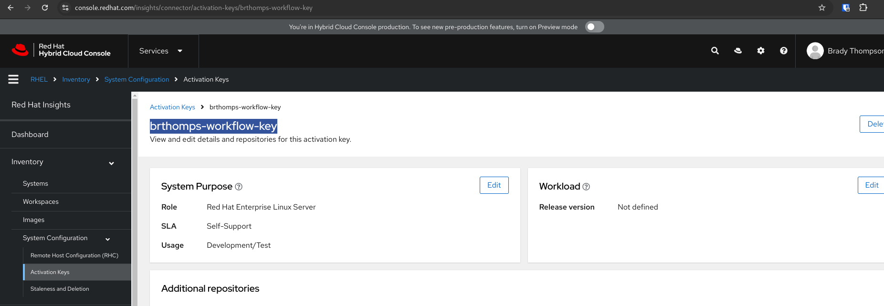
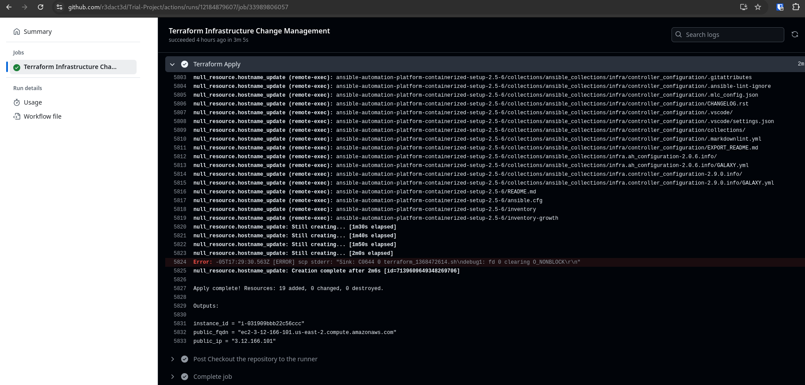

# Ansible Automation Platform 2.5 (Containerized)

## Terraform Infrastructure

### Summary

This project leverages Terraform to provision infrastructure and integrates GitHub Actions for streamlined automation. Key features include:

- A publicly accessible RHEL 9 EC2 instance running on AWS.
- AWS infrastructure and instance configuration automated with Terraform.
- GitHub Actions workflows for:
  - Automatically creating a Terraform plan on a pull request.
  - Applying infrastructure changes upon pull request merge.

> **Note:** Familiarize yourself with all resources in the `terraform` directory, particularly `main.tf`.

---

### Architecture Diagram


---

### Implementation

#### Procedure

1. **Gather Requirements**
   - Clone the GitHub repository.

2. **Configure Repository Secrets**  
   Add the following secrets in the GitHub repository settings:  
   - `AWS_ACCESS_KEY`  
   - `AWS_SECRET_ACCESS_KEY`  
   - `ORG_ID` (Profile in [cloud.redhat.com](https://cloud.redhat.com))  
   - `ACTIVATION_KEY` (Created in **Inventory > System Configuration > Activation Keys**)  
   - `RHN_USER` (Red Hat Network username)  
   - `RHN_PASS` (Red Hat Network password)  
   - `AAP_PASS` (Default password for the initial inventory file)  

     

   

3. **Validate Terraform Manifests**  
   Review and update files in the `terraform` directory as necessary:  
   - `main.tf`  
   - `output.tf`  
   - `user_data.txt`  

   > **Note:**  
   - Ensure your SSH public key is added to `user_data.txt`.  
   - Create an S3 bucket referenced in the backend configuration of `main.tf` (e.g., `tfstate-bucket-blinker19`).

#### Pull Request Validation

4. **Automated Validation with GitHub Actions**  
   GitHub Actions will validate pull requests with the following Terraform steps before allowing a merge:  
   - `terraform fmt`  
   - `terraform init`  
   - `terraform validate`  
   - `terraform plan`  

---

### Post-Infrastructure: Installing AAP 2.5

5. **Review Terraform Outputs**  
   After the GitHub Actions workflow completes, retrieve instance details from the output.  
   - Use the public IP to SSH into the instance (`ec2-user`).

   Validate:  
   - Expected results from `user_data.txt`.  
   - Expected results from the provisioner in `main.tf`.  
   - Contents of the `ansible` directory and inventory details.

   

6. **Install Ansible Automation Platform 2.5 (Containerized)**  
   Run the following command:  
   ```bash
   nohup ansible-playbook -i inventory-growth ansible.containerized_installer.install -e ansible_connection=local &>/dev/null &
