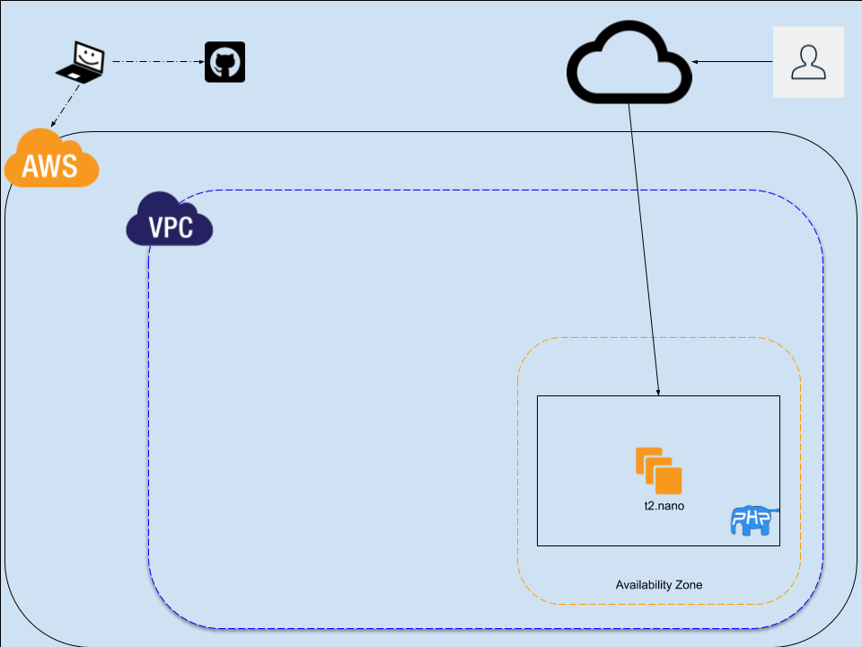
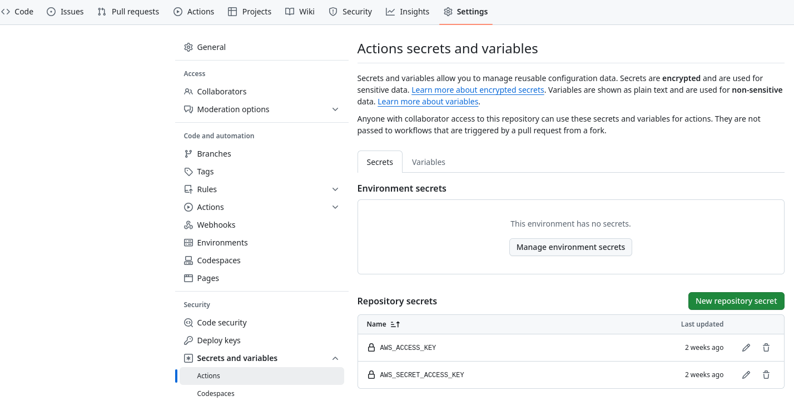

# Terraform & Ansible
## Trial Project

## Summary

- RHEL EC2 instance is running on AWS and is publicly accessible.
- AWS infra and instance is configured with an Terraform.
- GitHub Actions workflow with automatically create a Plan on a Pull Request
- GitHub Actions workflow will automatically apply infra changes on a Pull Request Merge


## Architecture Diagram



## Implementation
### Procedure
1. Gather requirements
  - Clone GitHub repository
  - AWS Access keys
2. Create or update Repository secrets 
  - AWS_ACCESS_KEY
  - AWS_SECRET_ACCESS_KEY



3. Validte the TF manifests in the terraform directory
  - main.tf
  - output.tf
  - user_data.txt

NOTE: you will need to put your ssh pub key in the main.tf file

NOTE: you will need to create an S3 bucket that is referenced in main.tf backend config ie. tfstate-bucket-blinker19

### Pull-Request Validation

- Github actions performs terraform steps to validate PR, before it is eligible for merge to master.
  - terraform fmt
  - terraform init
  - terraform validate
  - terraform plan

### Post Infra AAP Install

1. Copy installer files to new ec2 instance
```sh
scp ansible-automation-platform-containerized-setup-2.5-3.tar.gz ec2-user@pubIP:/home/ec2-user/
```

2. Login to ec2 instance - todo with user-data
```sh
sudo subscription-manager register
sudo dnf install -y ansible-core
tar xfvz ansible-automation-platform-containerized-setup-2.4-2.tar.gz
cd ansible-automation-platform*
sed -i 's/<set your own>/new-install-password/g' inventory-growth 
sed -i 's/aap.example.org/New-fqdn-FOR-GATEWAY/g' inventory-growth 
ansible-playbook -i inventory-growth ansible.containerized_installer.install -e ansible_connection=local
```